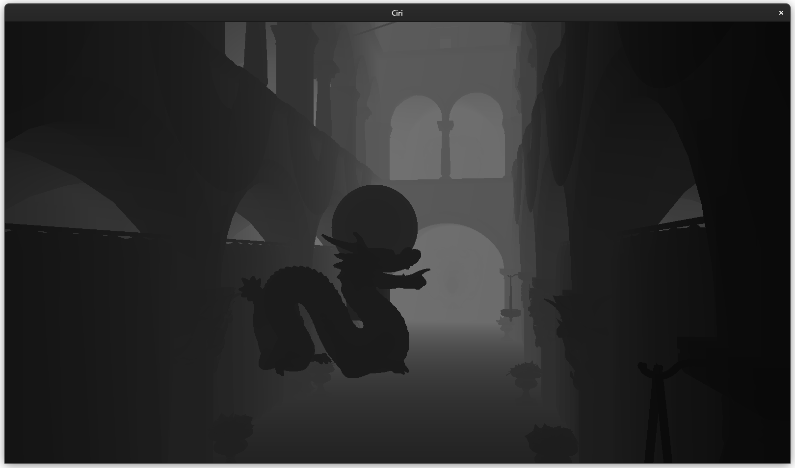
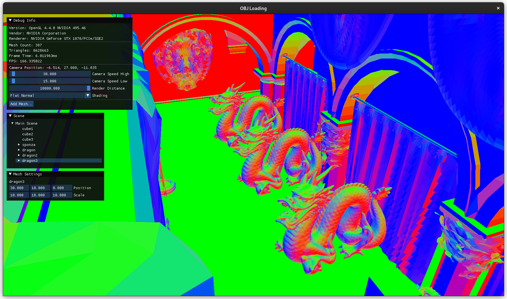
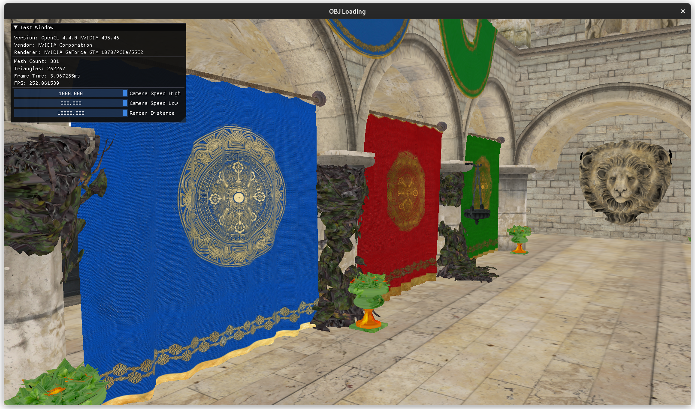
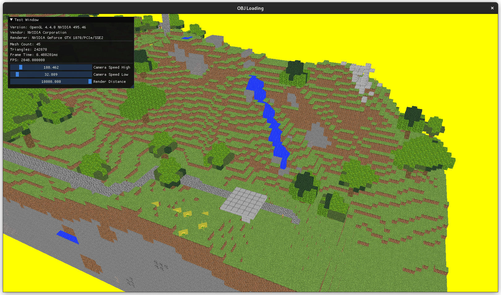
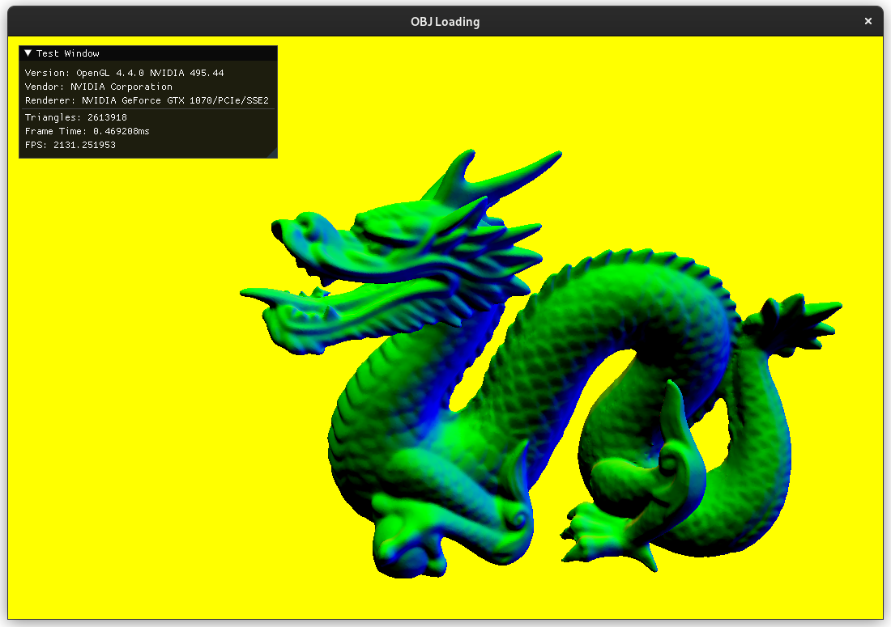
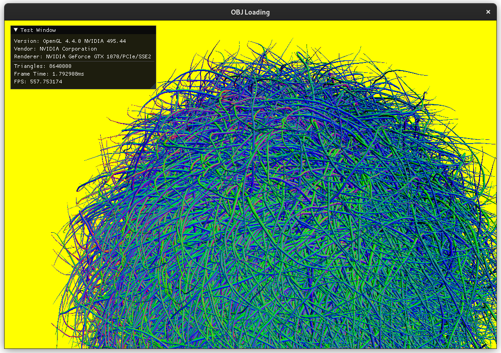

# Ciri Rendering Engine

## Media

## Cloning

This project uses git submodules so make sure to include `--recurse-submodules` when cloning:

    git clone --recurse-submodules https://github.com/cianjinks/Ciri

## Building

### Linux

First run `linux_setup.sh` then:

    cmake --build ./build/release OR cmake --build ./build/debug

The executable will be placed in the corresponding build folder.

### Windows

Running `win_setup.bat` will create a Visual Studio solution in the folder `./build`. VSCode CMake extension will also work out of the box.

## Resources

Test models contained in the `resources/models/obj` folder were downloaded from Morgan McGuire's [Computer Graphics Archive](https://casual-effects.com/data).

Test models contained in the `resources/models/gltf` folder were downloaded from [glTF-Sample-Models](https://github.com/KhronosGroup/glTF-Sample-Models).